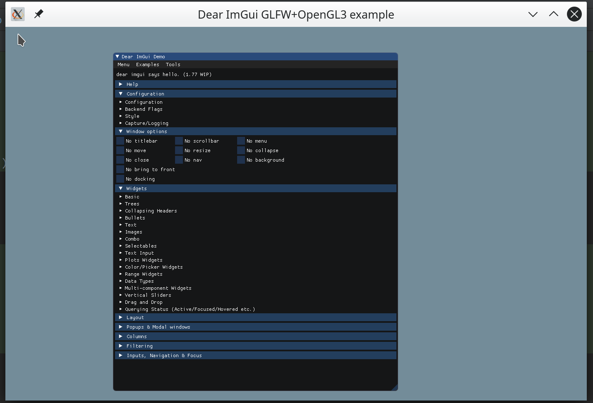

# lib-imgui

### 简介
* 利用CMake将 [imgui](https://github.com/ocornut/imgui) 作为的一个库，方便快速开发轻量级的GUI应用
* 窗口[glfw](https://www.glfw.org/) + 渲染库[opengl3](https://www.opengl.org/)
* 跨平台，支持linux & Windows


### 使用方式
1. 创建一个文件夹，初始化git工程，输入命令`git init`
2. 将`lib-imgui`作为一个`git`子模块,`git submodule add https://github.com/coding2233/lib-imgui.git`
3. 更新子模块的所有内容`git submodule update --init --recursive`
4. 创建`TestApp.h` `TestApp.cpp` `main.cpp`三个文件
5. 创建`CMakeLists.txt`文件，输入以下内容
```cmake
cmake_minimum_required(VERSION 3.5)

project(newgui)

add_subdirectory(lib-imgui)

include_directories(lib-imgui
        lib-imgui/imgui
        lib-imgui/imgui/examples)

if(WIN32)
    include_directories(lib-imgui/library/glew-2.2.0/include)
endif()

add_executable(${PROJECT_NAME} TestApp.cpp main.cpp)

target_link_libraries(${PROJECT_NAME} libimgui)
```
6. `TestApp`继承`ImGuiApp`，并重写`OnImGui`函数
* `test_app.h`
```c++
#ifndef NEWGUI_TESTAPP_H
#define NEWGUI_TESTAPP_H

#include "imgui_app.h"

#include <iostream>

class TestApp: public ImGuiApp {

public:
    TestApp();
    ~TestApp();

protected:
    void OnImGui() override ;
};


#endif //NEWGUI_TESTAPP_H
```
* `test_app.cpp`
```c++
#include "TestApp.h"


TestApp::TestApp() {}


TestApp::~TestApp() {}


void TestApp::OnImGui()
{
    ImGuiApp::OnImGui();
}
```
7. 实现`main.cpp`
```c++
int main(int argc char** args)
{
    TestApp app;
    app.Run();

    return 0;
}
```


### Build & Run

#### Linux
1. `mkdir build && cd build`
2. `cmake .. && make`
3. `./newgui`

#### Windows
1. `mkdir build && cd build`
2. `cmake ..`
3. `cmake --build ./`
4. `./newgui.exe`


#### Example
